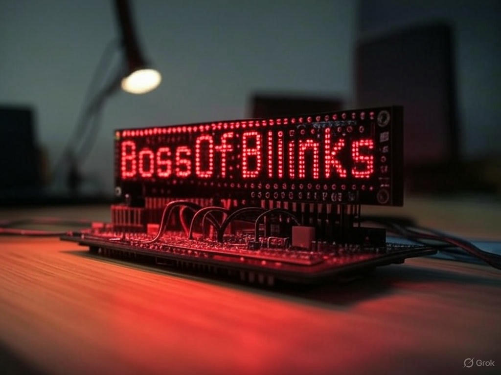

# BossOfBlinks

> Web-controlled LED matrix display using ESP8266 and Node.js


BossOfBlinks is an open-source project that allows you to control an LED matrix display wirelessly through a web interface. Using a Wemos D1 Mini (ESP8266) connected to a MAX72XX LED matrix, you can display custom text and emojis from anywhere on your local network.

## ✨ Features

- 📱 Web interface for controlling your LED matrix
- 📝 Display custom text and emojis
- 💾 Save message templates for quick access
- 🔄 Real-time updates between web and display
- 🔌 Simple USB configuration
- 📶 Multiple WiFi network support
- 🛠️ Expandable to multiple displays

## 🖼️ Screenshots

<!-- TODO: add web screenshot -->
<!--  -->



## 🧰 Hardware Requirements

- Wemos D1 Mini (ESP8266)
- MAX72XX LED Matrix (FC-16 type)
- Micro USB cable
- Computer for initial setup

### 📌 Wiring Diagram

```
+---------------+      +---------------+
|               |      |               |
|  Wemos D1 Mini|      |  MAX7219      |
|               |      |  LED Matrix   |
|               |      |               |
| D8 ---------------------> DIN        |
|               |      |               |
| D7 ---------------------> CS         |
|               |      |               |
| D6 ---------------------> CLK        |
|               |      |               |
| 3.3V ------------------> VCC         |
|               |      |               |
| G ----------------------> GND        |
|               |      |               |
+---------------+      +---------------+
```

## 🚀 Quick Start

1. Clone this repository
2. Upload the firmware to your Wemos D1 Mini
3. Start the Node.js server
4. Configure your device via USB
5. Access the web interface at http://localhost:3000

For detailed setup instructions, see the [Setup Guide](docs/setup.md).

## 🏗️ Project Structure

```
BossOfBlinks/
├── firmware/           # ESP8266 firmware (PlatformIO project)
│   ├── src/            # Source code
│   │   ├── main.cpp    # Main firmware file
│   │   └── font.h      # Custom font definition
│   └── platformio.ini  # PlatformIO configuration
│
├── server/             # Node.js server
│   ├── server.js       # Express server
│   ├── package.json    # Dependencies
│   └── public/         # Static assets (if needed)
│
├── docs/               # Documentation
│   ├── images/         # Photos and diagrams
│   └── setup.md        # Setup instructions
│
└── README.md           # Project overview
```

## 🖥️ Technology Stack

- **Firmware**: C++ with Arduino framework, PlatformIO
- **LED Control**: MD_Parola and MD_MAX72XX libraries
- **Server**: Node.js with Express
- **Web Interface**: HTML, CSS, JavaScript

## 📖 Documentation

- [Setup Guide](docs/setup.md)
- [Command Reference](docs/commands.md)
- [Troubleshooting](docs/troubleshooting.md)

## 🤝 Contributing

Contributions are welcome! Please feel free to submit a Pull Request.

## 📜 License

This project is licensed under the MIT License - see the [LICENSE](LICENSE) file for details.

## 🙏 Acknowledgements

- [MD_Parola](https://github.com/MajicDesigns/MD_Parola) - LED matrix library
- [ArduinoJson](https://arduinojson.org/) - JSON library for Arduino
- [Express](https://expressjs.com/) - Web framework for Node.js
