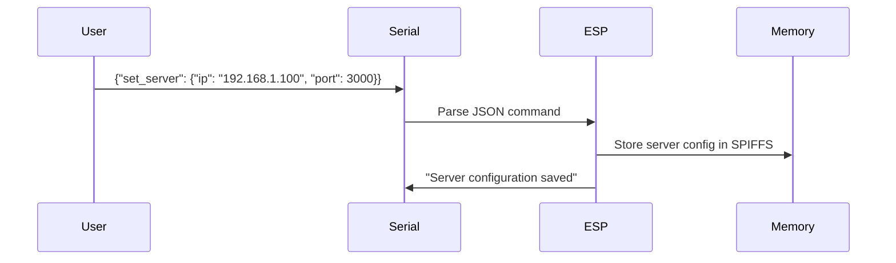
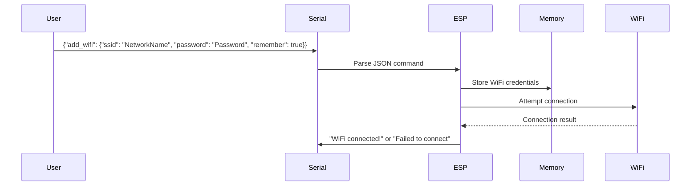
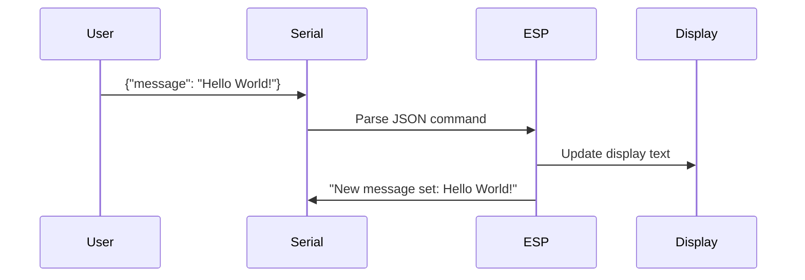

# BossOfBlinks Command Reference

This document provides a detailed reference for all commands that can be used with the BossOfBlinks system, including serial commands for device configuration and API endpoints for the web interface.

## Serial Commands

These commands can be sent via the serial monitor in VS Code/PlatformIO when the device is connected via USB.

### Server Configuration

Set the IP address and port of the web server:

```json
{ "set_server": { "ip": "192.168.1.100", "port": 3000 } }
```

Parameters:

- `ip`: String, the IP address of your web server
- `port`: Number, the port your web server is running on (typically 3000)

### WiFi Configuration

Add a WiFi network to connect to:

```json
{
  "add_wifi": {
    "ssid": "NetworkName",
    "password": "WiFiPassword",
    "remember": true
  }
}
```

Parameters:

- `ssid`: String, the name of your WiFi network
- `password`: String, the password for your WiFi network
- `remember`: Boolean, whether to save this network permanently (true) or just use it once (false)

### Display Message

Send a message directly to the LED matrix:

```json
{ "message": "Hello World!" }
```

Parameters:

- `message`: String, the text you want to display

### Device Control

Restart the device:

```json
{ "restart": true }
```

Perform a factory reset (erase all settings):

```json
{ "reset": true }
```

## Command Responses

When sending commands via serial, you'll see responses in the serial monitor:

### Successful Responses

Server configuration saved:

```
Server configuration saved
```

WiFi network added:

```
WiFi network added: NetworkName
```

WiFi connection established:

```
WiFi connected!
IP address: 192.168.1.123
```

### Error Responses

Failed to parse JSON:

```
Error parsing command: InvalidInput
```

Failed to connect to WiFi:

```
Failed to connect to any WiFi network
```

Failed to connect to server:

```
HTTP request failed with code: -1
```

## Command Flow Diagrams

### Server Configuration Flow



### WiFi Configuration Flow



### Message Display Flow



## API Endpoints

These endpoints can be used to interact with the web server programmatically.

### Get Current Message

Endpoint: `GET /api/current-message`

Response:

```json
{
  "message": "Hello World"
}
```

### Set New Message

Endpoint: `POST /api/set-message`

Request Body:

```json
{
  "message": "New message to display"
}
```

Response:

```json
{
  "success": true,
  "message": "New message to display"
}
```

### Get Device Status

Endpoint: `GET /api/status`

Response:

```json
{
  "connected": true,
  "wifiName": "NetworkName",
  "ipAddress": "192.168.1.123",
  "currentMessage": "Hello World",
  "lastSeen": "2025-03-05T12:34:56.789Z"
}
```

## Advanced Usage

### Multiple WiFi Networks

You can add multiple WiFi networks for the device to try connecting to:

```json
{"add_wifi": {"ssid": "HomeWiFi", "password": "Password1", "remember": true}}
{"add_wifi": {"ssid": "OfficeWiFi", "password": "Password2", "remember": true}}
```

The device will try each saved network in order until it connects successfully.

### Testing Server Connection

You can test if your server is accessible to the ESP8266 by sending this command to force an immediate check:

```json
{ "message": "Server Test" }
```

Then watch the serial monitor for HTTP request results.

### Debugging Mode

For troubleshooting, you can send a message to see more detailed output:

```json
{ "message": "Debug Mode" }
```

This will cause the ESP8266 to output more detailed logs to the serial monitor.

## VS Code Serial Monitor Tips

1. **Line Ending**: Make sure the serial monitor is set to send a newline character at the end of each command. In PlatformIO, this is typically the default setting.

2. **JSON Format**: All commands must be valid JSON. Use double quotes for strings and ensure proper formatting.

3. **Baud Rate**: The serial monitor should be set to 115200 baud rate to match the firmware configuration.

4. **Filters**: You can use the built-in filters in the PlatformIO serial monitor to make the output more readable:

   - `colorize`: Adds color to the output
   - `time`: Adds timestamps to messages
   - `esp8266_exception_decoder`: Helps decode any crash information

5. **Quick Access**: In VS Code with PlatformIO, you can quickly open the serial monitor by clicking the plug icon in the bottom toolbar or using the command palette (Ctrl+Shift+P) and typing "PlatformIO: Serial Monitor".
