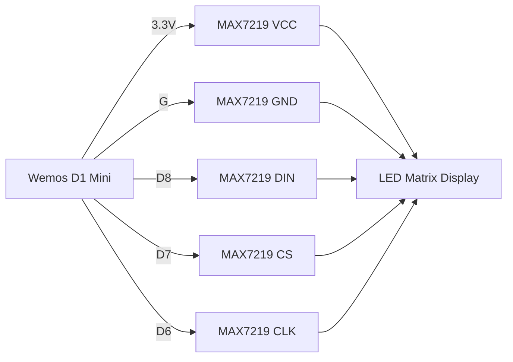
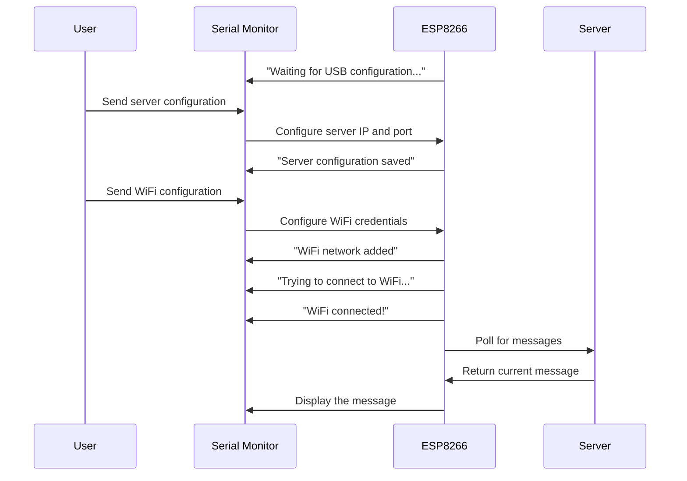
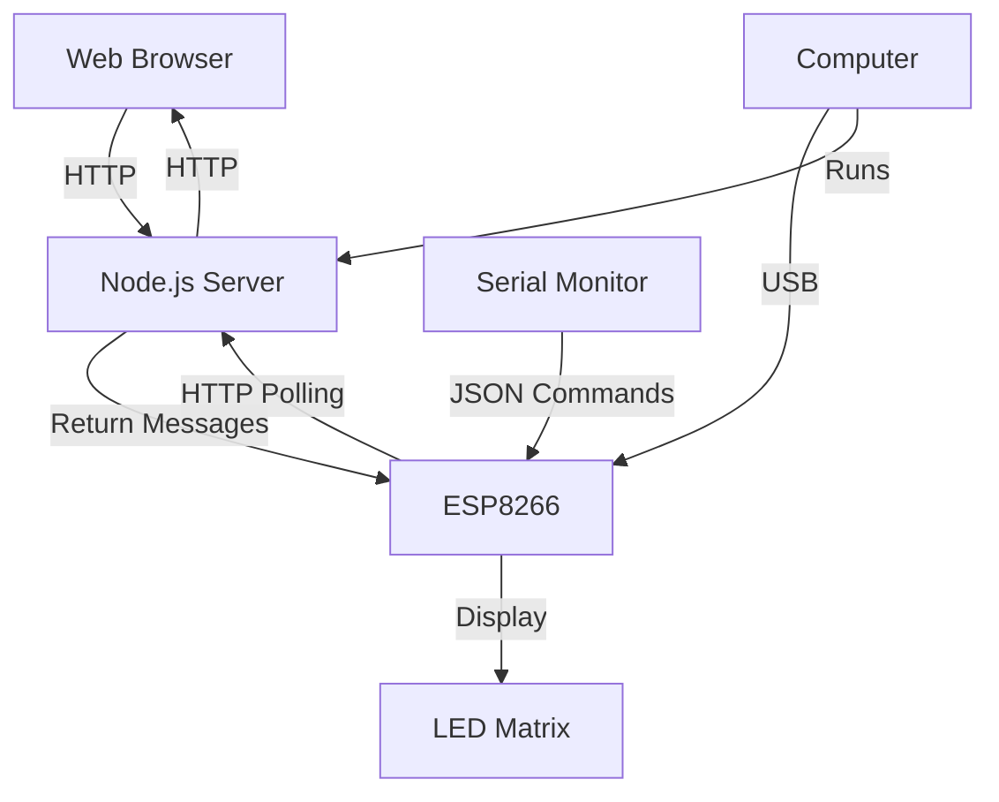
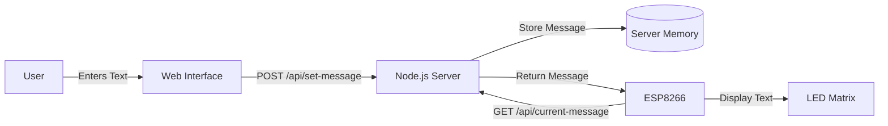

# BossOfBlinks Setup Guide

This document provides detailed instructions for setting up the BossOfBlinks LED matrix control system.

## Table of Contents

- [Hardware Setup](#hardware-setup)
- [Firmware Installation](#firmware-installation)
- [Server Setup](#server-setup)
- [Initial Configuration](#initial-configuration)
- [Using the Web Interface](#using-the-web-interface)
- [Command Reference](#command-reference)
- [Troubleshooting](#troubleshooting)

## Hardware Setup

### Components

- Wemos D1 Mini (ESP8266 microcontroller)
- MAX72XX LED Matrix module (FC-16 type)
- Micro USB cable
- Jumper wires

### Wiring Diagram

Connect your Wemos D1 Mini to the MAX72XX LED Matrix as follows:

| Wemos D1 mini | MAX7219 |
| ------------- | ------- |
| 3.3V          | VCC     |
| G             | GND     |
| D8            | DIN     |
| D7            | CS      |
| D6            | CLK     |

### Visual Connection Diagram



## Firmware Installation

### Prerequisites

- [Visual Studio Code](https://code.visualstudio.com/)
- [PlatformIO Extension](https://platformio.org/install/ide?install=vscode)

### Steps

1. Clone the BossOfBlinks repository:

   ```bash
   git clone https://github.com/yourusername/BossOfBlinks.git
   cd BossOfBlinks
   ```

2. Open the firmware folder in VS Code with PlatformIO installed:

   ```bash
   code firmware/
   ```

3. Ensure your `platformio.ini` file contains the following:

   ```ini
   [env:d1_mini]
   platform = espressif8266
   board = d1_mini
   framework = arduino
   monitor_speed = 115200
   upload_speed = 921600
   lib_deps =
       majicdesigns/MD_Parola@^3.7.1
       majicdesigns/MD_MAX72XX@^3.4.1
       bblanchon/ArduinoJson@^6.21.3
   ```

4. Connect your Wemos D1 Mini to your computer via USB.

5. Upload the firmware:

   - Click the PlatformIO "Upload" button (→) in the bottom toolbar
   - Or run this command: `pio run --target upload`

6. Open the serial monitor to communicate with the device:
   - Click the PlatformIO "Serial Monitor" button in the bottom toolbar
   - Or run this command: `pio device monitor`

## Server Setup

### Prerequisites

- [Node.js](https://nodejs.org/) (v14 or later)
- npm (included with Node.js)

### Steps

1. Navigate to the server directory:

   ```bash
   cd server/
   ```

2. Install dependencies:

   ```bash
   npm install
   ```

3. Start the server:

   ```bash
   node server.js
   ```

4. The server will display a message with its IP address:

   ```
   Server running at http://0.0.0.0:3000
   Test the API at http://localhost:3000/api/test
   Your computer's IP is likely one of these:
   - http://192.168.1.100:3000
   ```

5. Note down the IP address (e.g., `192.168.1.100`) for configuring the ESP8266.

## Initial Configuration

After uploading the firmware, your device will start in "USB Setup" mode, waiting for configuration through the serial monitor.

### Configuration Process



### Serial Commands

To configure your device, send these JSON commands through the serial monitor:

1. Set the server configuration (replace with your actual server IP):

   ```json
   { "set_server": { "ip": "192.168.1.100", "port": 3000 } }
   ```

2. Add WiFi credentials (replace with your actual WiFi details):

   ```json
   {
     "add_wifi": {
       "ssid": "YourWiFiName",
       "password": "YourWiFiPassword",
       "remember": true
     }
   }
   ```

3. Restart the device to apply the configuration:

   ```json
   { "restart": true }
   ```

4. To test the display directly, send a message:
   ```json
   { "message": "Hello World!" }
   ```

### Command Reference

Here's a complete list of commands you can send via the serial monitor:

| Command      | Description                        | Example                                                                        |
| ------------ | ---------------------------------- | ------------------------------------------------------------------------------ |
| `set_server` | Configure server IP and port       | `{"set_server": {"ip": "192.168.1.100", "port": 3000}}`                        |
| `add_wifi`   | Add WiFi credentials               | `{"add_wifi": {"ssid": "WiFiName", "password": "Password", "remember": true}}` |
| `message`    | Display a message                  | `{"message": "Hello World!"}`                                                  |
| `restart`    | Restart the device                 | `{"restart": true}`                                                            |
| `reset`      | Factory reset (erase all settings) | `{"reset": true}`                                                              |

## Using the Web Interface

Once everything is set up, you can control your LED matrix through the web interface:

1. Open a web browser and go to your server address (e.g., `http://192.168.1.100:3000`)
2. Enter a message in the input field
3. Click "Send to Display" to update the LED matrix
4. Use the emoji picker to add special characters
5. Save commonly used messages as templates

## System Architecture

The complete BossOfBlinks system architecture:



## Data Flow

The data flow for updating messages:



## Troubleshooting

### ESP8266 Can't Connect to WiFi

- Ensure WiFi credentials are correct
- Check that the WiFi network is 2.4GHz (ESP8266 doesn't support 5GHz)
- Make sure the WiFi signal is strong enough

### ESP8266 Can't Connect to Server

- Verify the server is running
- Check that the server IP address is correct
- Ensure there are no firewall rules blocking the connection
- Try using the `--host 0.0.0.0` flag when starting the Node.js server

### LED Matrix Display Issues

- Check all wiring connections
- Verify the pin configuration in the firmware matches your wiring
- Ensure the MAX72XX module is properly powered
- Try adjusting the brightness in the firmware

### Serial Communication Problems

- Make sure the serial monitor is set to 115200 baud rate
- On Linux, you may need to add your user to the dialout group:
  ```bash
  sudo usermod -a -G dialout $USER
  sudo chmod a+rw /dev/ttyUSB0
  ```

## Next Steps

After completing the basic setup, you can:

1. Customize the web interface
2. Add authentication to the server
3. Implement additional message effects
4. Create an enclosure for your display
5. Add support for multiple LED matrices

For more advanced customization, refer to the code documentation and library references.
